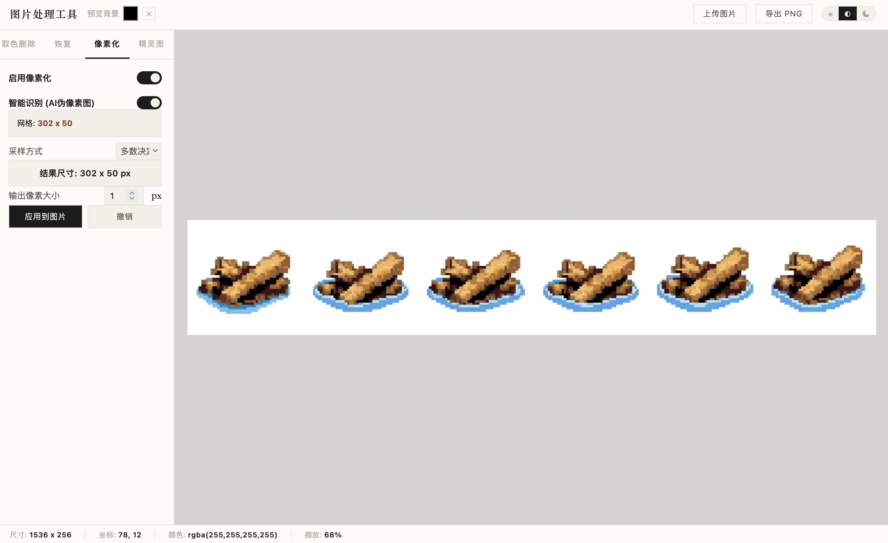
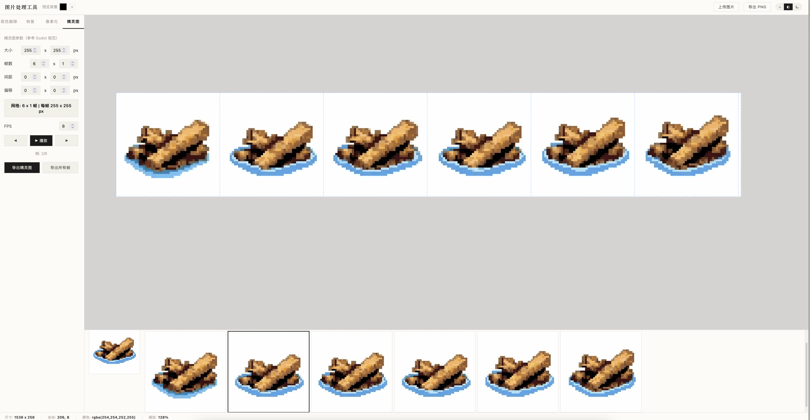

# Pixel Art Processor
## 像素艺术处理器

这个项目是用于处理AI生成的像素艺术的一系列工作流，使用TS开发

主要功能为：
- 手动选择背景色并扣图，支持手动擦除选择
- 将AI处理的“像素风格”图处理成真正的像素图
- 精灵图处理功能：偏移、补全帧的像素大小

仓库里现在有四部分：

- `index.html`：浏览器页面，包含上述所有功能，纯前端静态页面不依赖任何后端，已部署到(Github Page)[https://huluntuntao.github.io/pixel_art_processor/]
- `perfect-pixel-ts`：TypeScript 版本的 Perfect Pixel，只有“AI像素风格图片”转像素图功能
- `perfect-pixel-cli`：命令行工具封装的Perfect Pixel，适用于部署有Node的环境，用于在本地批量将AI生成的像素风格图片转换为像素图

## 这项目做什么

AI 生成的像素风图片经常看起来像像素画，但细看会有不少问题：

- 网格不齐
- 单个像素块大小不稳定
- 轮廓边缘发虚

## 项目截图





该项目通过估计网格，再修正网格位置，重新采样颜色，得到一张更规整的像素图。

## 算法来源

这个项目的核心算法来自上游项目 `theamusing/perfectPixel`：

- 上游仓库：<https://github.com/theamusing/perfectPixel>

这里的前端页面、TypeScript 实现和 CLI，都是基于该算法做的移植和封装。

相关许可说明见：

- [LICENSE](./LICENSE)
- [THIRD_PARTY_NOTICES.md](./THIRD_PARTY_NOTICES.md)

## 仓库结构

### `index.html`

一个本地演示页面，主要用来：

- 导入图片
- 调整参数
- 预览处理结果
- 导出图片

页面依赖 `perfect-pixel-ts/dist/index.global.js`，所以第一次使用前需要先构建 TypeScript 库。

### `perfect-pixel-ts`

算法的 TypeScript 实现，适合在浏览器或 Node 环境里调用。

当前导出的核心接口是：

```ts
getPerfectPixel(imageData, options)
```

主要参数包括：

- `sampleMethod`
- `gridSize`
- `minSize`
- `peakWidth`
- `refineIntensity`
- `fixSquare`

### `perfect-pixel-cli`

命令行封装，适合批量处理图片。

支持的常用参数：

- 输入文件
- 输出文件
- 采样方式
- 手动指定网格大小
- 输出放大倍数


## 算法流程

整体流程很直接，大致是三步：

1. 检测图里的像素网格大小
2. 用边缘信息微调网格线位置
3. 按网格重新采样颜色，输出结果


## 快速开始

### 先构建 TypeScript 库

```bash
cd perfect-pixel-ts
npm install
npm run build
```

构建完成后，浏览器页面和 CLI 都能用到它的产物。

### 浏览器演示

直接打开根目录的 `index.html`。

如果浏览器因为本地文件权限拦截脚本，可以起一个简单静态服务器再访问。

### TypeScript 调用

```ts
import { getPerfectPixel } from 'perfect-pixel-ts';

const result = getPerfectPixel(imageData, {
  sampleMethod: 'majority',
  refineIntensity: 0.25,
  fixSquare: true,
});
```

### CLI

#### 基本用法

```bash
cd perfect-pixel-cli
npm install
npm run build
node dist/cli.js <input_file> [options]
```

#### 参数说明

| 参数/选项 | 说明 | 默认值 |
| :--- | :--- | :--- |
| `input` | 输入图片路径 | (必填) |
| `-o, --output <path>` | 输出路径 | `<input>_pixel.png` |
| `-m, --method <name>` | 采样方法: `majority` \| `center` \| `median` | `majority` |
| `-s, --size <WxH>` | 手动指定网格大小, 如 `32x32` | 自动检测 |
| `--scale <n>` | 输出放大倍数 (原始像素大小的倍数) | `1` |
| `-h, --help` | 显示帮助 | - |

#### 示例用法

```bash
# 自动检测网格并转换，放大 8 倍
node dist/cli.js input.png -o output.png --scale 8

# 手动指定 16x16 网格，使用中心采样
node dist/cli.js input.png -s 16x16 -m center
```

如果已经安装了可执行命令，也可以这样用：

```bash
perfect-pixel input.png -o output.png -s 32x32 --scale 8
```


## 开发

### TypeScript

```bash
cd perfect-pixel-ts
npm install
npm run dev
```

### CLI

```bash
cd perfect-pixel-cli
npm install
npm run build
```


## 许可证

本仓库以 GPLv3 发布，详见 [LICENSE](./LICENSE)。

其中涉及的上游 `perfectPixel` 算法来源和第三方许可说明见 [THIRD_PARTY_NOTICES.md](./THIRD_PARTY_NOTICES.md)。
